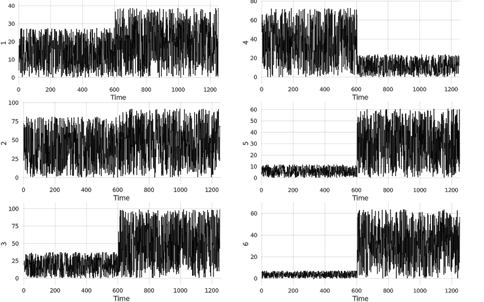

# RealtimeplotExample
Working on real time plotting with Julia and Makie.

## Goals

The main goal is real time plotting of some values parsed from a JSON string, which we get via TCP.
Different values are in the JSON, but the value is always a 6 long array of real numbers.

I want to pause/restart plotting and also to save the plotted variables.
Pausing the plot means here to not update the plot.
Meanwhile receiving the new values should not stop.
The following buttons work:
* `p`: pause plot.
* `r`: restart plot.
* `s`: saving the variables.

Would be nice of it would work for different JSONs.
For that, later I would use command-line arguments (probably).

## Code

```julia
msgstart = "{\"actual_q\": "
msgmid = ", \"actual_qd\": "
msgend = "}"
a1 = rand(12)

λ = 100 .*rand(12)
i = 0
while isopen(socket) && client_enabled
    println(socket, msgstart, a1[1:6], msgmid, a1[7:12], msgend)
    a1 = rand(12) .*λ

    if i > 1300
        λ = 100 .*rand(12)
        i = 0
    end
    i +=1
    sleep(sleeptime)
end
```
This part of the code scales the values to simulate the changing values.
This is needed because it's possible that we get values that are out of the current range.
For 1300 iterations the same `λ` is used, because the plot is "1250 wide".
On the example picture this can be seen at around x=900.



## Problems/questions

* One of my problems is that everything is global variable, because I couldn't find another way to do this. I feel this fragile.
* Should I use other data structure (for example [CircularBuffer](http://juliacollections.github.io/DataStructures.jl/latest/circ_buffer.html)) instead of `push/pop` to native arrays?
